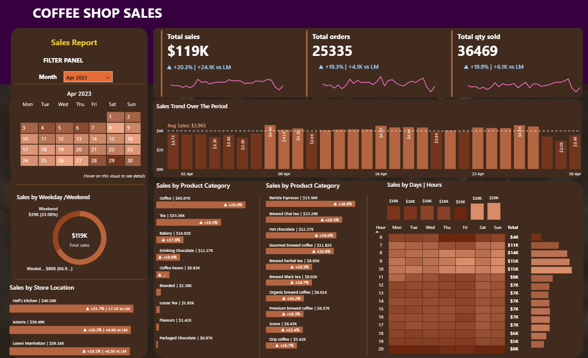

# ☕ Coffee Shop Sales Analysis

## 📌 Project Overview
This project analyzes coffee shop sales data to identify sales trends, top-selling products, and business performance using Excel and Power BI.

## 📈 Project Workflow

Raw Data (Excel)
⬇️
Data Cleaning (Excel)
⬇️
Data Modeling (Power BI)
⬇️
Dashboard Creation
⬇️
Business Insights

## 🎯 Objectives
- Analyze sales performance
- Identify top-selling products
- Track monthly sales trends
- Compare category-wise performance
- Build an interactive dashboard

## 🛠 Tools Used
- Microsoft Excel
- Power BI

## 📂 Dataset
The dataset contains coffee shop transaction data including:
- Product
- Category
- Quantity
- Sales
- Date
- Store Location

## 📊 Dashboard Preview

## 💡 Key Insights
- Top-selling products
- Best-performing categories
- Monthly sales trends
- Revenue analysis

## 🚀 Skills Demonstrated
- Data Cleaning
- Data Analysis
- Dashboard Design
- Data Visualization
